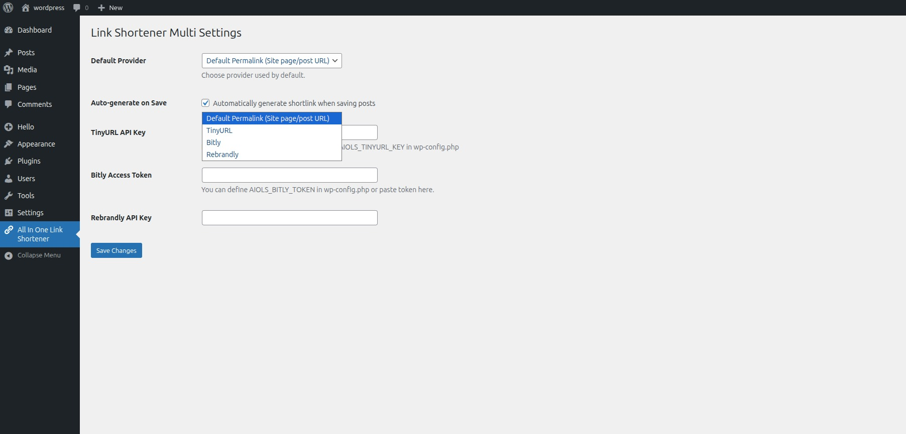
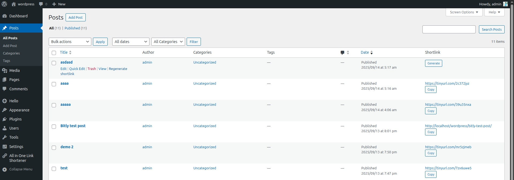
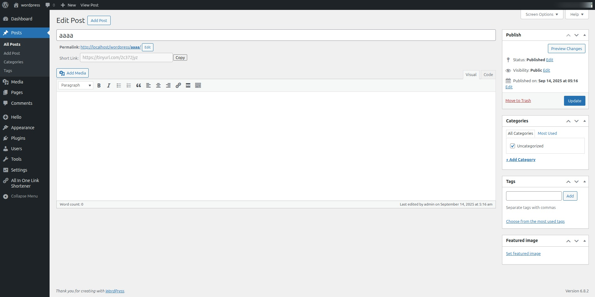
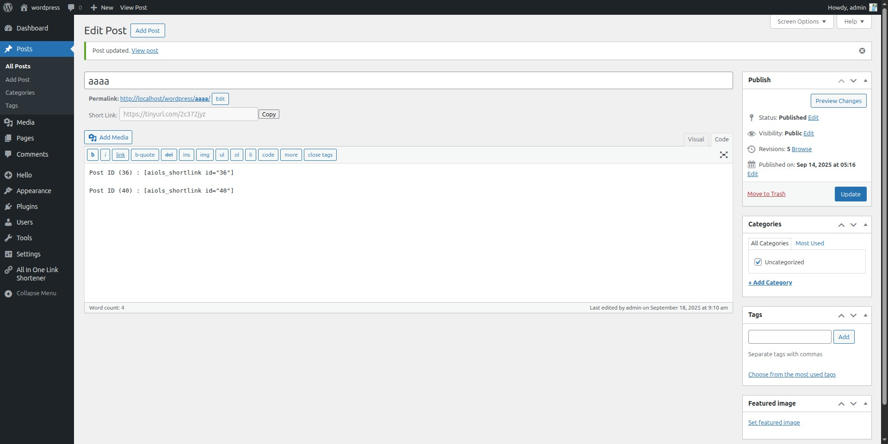

# All In One Link Shortener

---

## 📊 Repo Stats


---

**Contributors:** [shitalparmar443](https://profiles.wordpress.org/shitalparmar443/)  
**Donate link:** [PayPal](https://www.paypal.me/shitalparmar443/)  
**Tags:** shortlink, permalink, seo, url-shortener, links  
**Requires at least:** 6.1  
**Tested up to:** 6.8  
**Stable tag:** 1.0  
**Requires PHP:** 7.4  
**License:** GPLv2 or later  
**License URI:** [https://www.gnu.org/licenses/gpl-2.0.html](https://www.gnu.org/licenses/gpl-2.0.html)  

Create shortlinks for WordPress posts/pages with **Bitly, TinyURL, Rebrandly**, or **native permalinks**.

---

## 📖 Description

**All In One Link Shortener** makes it easy to generate shortlinks for your WordPress content.  
You can choose from multiple providers such as **Bitly, TinyURL, Rebrandly**, or simply use your **own WordPress permalink**.

### 🔑 Compliance with WordPress.org Guidelines
- **External Services**: Only the permalink of your post/page is sent to third-party APIs (Bitly, TinyURL, Rebrandly). No personal data, titles, or analytics are transmitted.  
- **Privacy**: The plugin does **not** track users, collect analytics, or include hidden data collection. Shortlinks are only generated when publishing or updating a post.  

### ✨ Features
- Automatic shortlink generation on publish/update.  
- Providers: Bitly, TinyURL, Rebrandly, or native WordPress permalinks.  
- Copy-to-clipboard button in post editor and list tables.  
- Regenerate shortlinks via post actions or bulk actions.  
- WP-CLI support for developers.  
- Shortcode `[aiols_shortlink id="123"]`.  
- Secure API token setup in plugin settings.  

---

## 🔐 How to Generate API Tokens

### Bitly (Generic Access Token)
1. Sign in at [bitly.com](https://bitly.com).  
2. Go to **Settings → API / Developer**.  
3. Generate a **Generic Access Token**.  
4. Copy and paste it into **All In One Link Shortener**.  

### TinyURL (API Key)
1. Sign up/sign in at [TinyURL](https://tinyurl.com/app/dev).  
2. Open **Developer / API Settings**.  
3. Create an **API Key**.  
4. Paste it into the plugin settings.  

### Rebrandly (API Key)
1. Sign in at [Rebrandly Dashboard](https://app.rebrandly.com/).  
2. Go to **Developer → API Keys**.  
3. Generate a new API key.  
4. Paste it into the plugin settings.  

### Add Token to Plugin
1. Go to **WordPress Admin → All In One Link Shortener**.  
2. Select your provider and paste the token.  
3. Save changes and publish a post to verify shortlink generation.  

---

## Security Best Practices
1. Treat tokens as secrets — never commit them to Git or expose in public code.  
2. Store tokens only in plugin settings (WordPress Options) and never print them in frontend HTML.  
3. Limit token scope if the provider supports scopes/permissions.  
4. Rotate (revoke/regenerate) tokens periodically or immediately if compromised.  
5. Document in your plugin readme where tokens are stored and include links to each provider's privacy/terms pages.

---

## Open source
1. Open source fully code: https://github.com/shitalparmar443/all-in-one-link-shortener/blob/main/README.md 
2. You can pull request anytime if you add new features or find any bugs — pull requests are welcome.
   
---

## ⚙️ Installation

1. Upload the plugin to `/wp-content/plugins/all-in-one-link-shortener`.  
2. Activate it from the **Plugins** menu in WordPress.  
3. Open **All In One Link Shortener**.  
4. Choose your default provider and enter an API token if required.  
5. Publish or update a post to generate a shortlink.  

---

## ❓ Frequently Asked Questions

**Which providers are supported?**  
- WordPress Permalinks (no external API)  
- Bitly → [API Docs](https://dev.bitly.com/)  
- TinyURL → [API Docs](https://tinyurl.com/app/dev)  
- Rebrandly → [API Docs](https://developers.rebrandly.com/)  

**Do I need an API token?**  
Yes, for Bitly, TinyURL, and Rebrandly. Permalinks don’t require one.  

**What data is sent?**  
Only the permalink URL. No personal data is shared.  

**Where are shortlinks stored?**  
Shortlinks are stored as post meta (`_aiols_shortlink`).  

**Can I use this plugin without third-party services?**  
Yes. Select **Permalink** as the provider.  

---

## 🖼️ Screenshots

### Admin Dashboard







### Frontend Example


1. Copy shortlink button in editor.  
2. Shortlink column in post list.  
3. Settings page with provider + token options.  

---

## 📌 Changelog

### 1.0
- Initial release  
- Multi-provider shortlink support (Bitly, TinyURL, Rebrandly)  
- Default Permalink provider (no external API calls)  
- Bulk regenerate + WP-CLI support  
- Shortcode `[aiols_shortlink]`  

---

## 🔔 Upgrade Notice

### 1.0
First release. Token-based providers supported. Only permalinks are sent to third-party APIs.

---

## Notes

- This plugin is open-source. Contributions are welcome via the GitHub repository.

- If you find issues or want to contribute new features, please open a pull request on GitHub: https://github.com/shitalparmar443/all-in-one-link-shortener

---

## Support

- For support, please use the plugin's support forum on WordPress.org or open an issue on GitHub.

---

### Is there a shortcode?  
Yes:  

```php
[aiols_shortlink id="123"]
